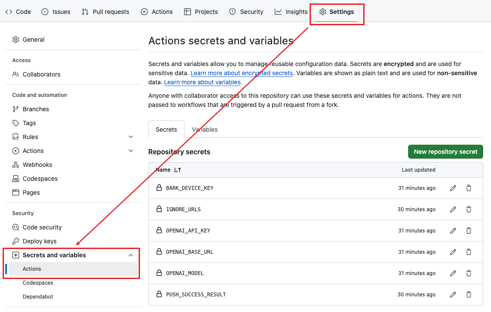

# 我的网络收藏

## 框架
在原项目 [astro-paper](https://github.com/satnaing/astro-paper) 基础上改动点：

- [x] 一些样式的改变
- [x] zoom images like Medium，使用的是 [medium-zoom](https://github.com/francoischalifour/medium-zoom)
- [x] Table of contents(TOC) 固定页面右侧，使用的是 [tocbot](https://github.com/tscanlin/tocbot)
- [x] 删除 Back To Top
- [x] 删除 ShareLinks
- [x] tags 移到页面上方，标题下方
- [x] 集成 MDX，参考 [@astrojs/mdx | Docs](https://docs.astro.build/en/guides/integrations-guide/mdx/)
- [x] ~~新标签页打开页面中链接~~ [Should Links Open In New Windows? — Smashing Magazine](https://www.smashingmagazine.com/2008/07/should-links-open-in-new-windows/)
- [ ] 集成评论系统，准备使用 [Giscus](https://github.com/giscus/giscus)

## 内容

整体分类三类：  
1. `favorites`，手动维护的内容，个人正在使用的东西
2. `bookmarks`，通过 API 收藏的内容，无需获取原文和总结内容
3. `posts`，个人创作的各类文章

### Bookmarks
通过 API 收藏，commit message 格式为
```text
[API][bookmark][ARSP]: {标题}


{url, title, description, tags 组成的 json 格式}
```

双重跳过执行校验
1. 参考 [Skipping workflow runs - GitHub Docs](https://docs.github.com/en/actions/managing-workflow-runs-and-deployments/managing-workflow-runs/skipping-workflow-runs) ，在 commit message 中添加 `[skip actions]` 以跳过 push 类型的 action
2. 参考 [Using conditions to control job execution - GitHub Docs](https://docs.github.com/en/actions/writing-workflows/choosing-when-your-workflow-runs/using-conditions-to-control-job-execution) ，在 action job 中添加 if 语句判断，只有最新 commit message 是以 `[API][bookmark][ARSP]` 开头的，才会执行 job
    
    ```
    if: ${{ startsWith(github.event.head_commit.message, '[API][bookmark][ARSP]') }}
    ```

**备注：**
> `[skip actions]` 只会跳过 github workflow，不会跳过 Cloudflare Workers and Pages 的构建，可以再添加 `[CF-Pages-Skip]` 来跳过
> 或者直接使用 `[skip ci]` 来跳过所有 action

## 设置

### 设置权限


### 设置 secrets  



1. `OPENAI_API_KEY`，OpenAI API KEY
2. `OPENAI_BASE_URL`，OpenAI base url，默认为 `https://api.openai.com/v1`
3. `OPENAI_MODEL`，OpenAI 模型，默认为 `gpt-4o-mini`
4. `IGNORE_URLS`，在 action 执行时忽略的 URL 列表，使用英文逗号分割，默认为 `x.com,twitter.com`
5. `PUSH_SUCCESS_RESULT`，action 执行完成后，会通过 [Bark](https://github.com/finb/bark) 推送消息到 iPhone，默认值为 `false`，即只推送失败的情况，改为 `true` 也可推送成功的情况。
6. `BARK_DEVICE_KEY`，使用 [Bark](https://github.com/finb/bark) 推送消息时所需的 KEY 
